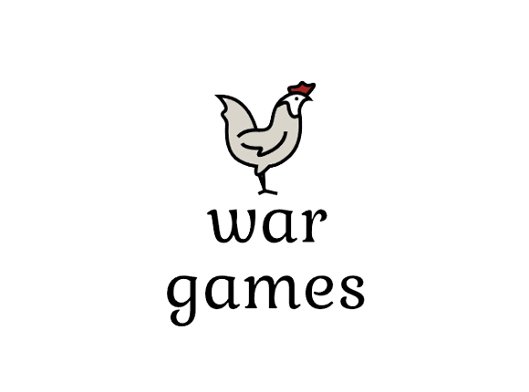

# Wargames

## Description
The project has been commissioned in the course IDATG2001, and aims to develop a program that can simulate a battle between two armies in a war.
The program allows you to load the armies from files and the file name / file location is specified, terrain can be selected, you can simulate a battle, 
you are informed about the result of the simulation, the condition of the two armies is shown afterwards and the winner is displayed,
it is possible to reset the simulation, both by entering file locations again and without, and it is possible to save the armies to a csv file.

## Authors and acknowledgment 
Martin Hegnum Johannessen - marhjoh@stud.ntnu.no

## Project status
Finished product.

