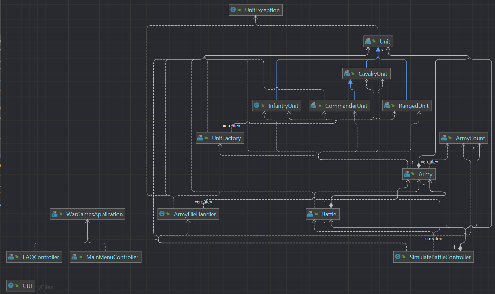
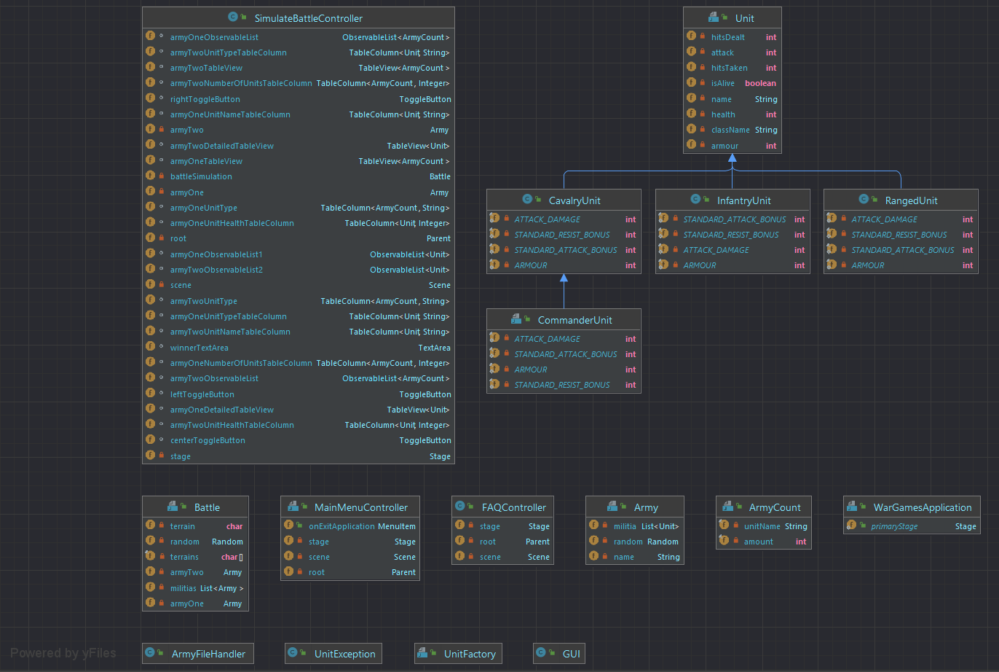
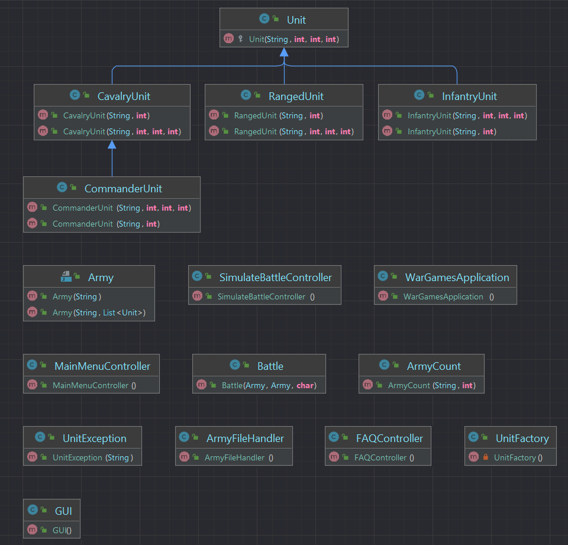
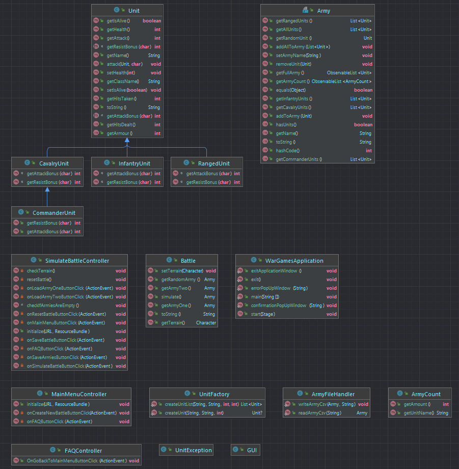
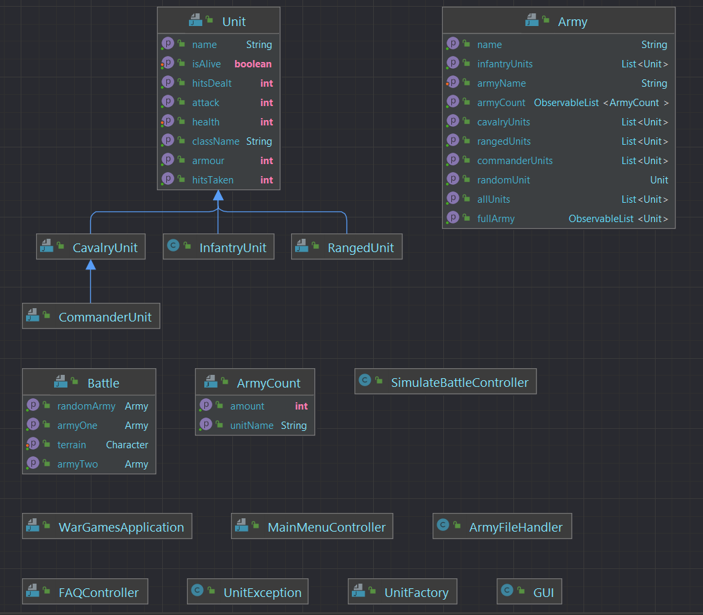

All of the classes are public.

**UML Class Diagram with dependencies** 

**UML Class Diagram with fields** 

**UML Class Diagram with constructors** 

**UML Class Diagram with methods** 

**UML Class Diagram with properties** 
