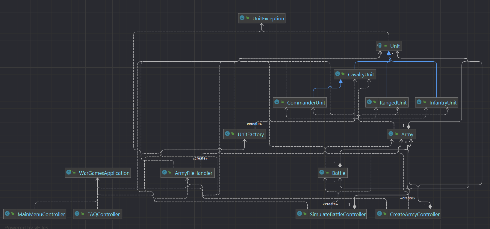
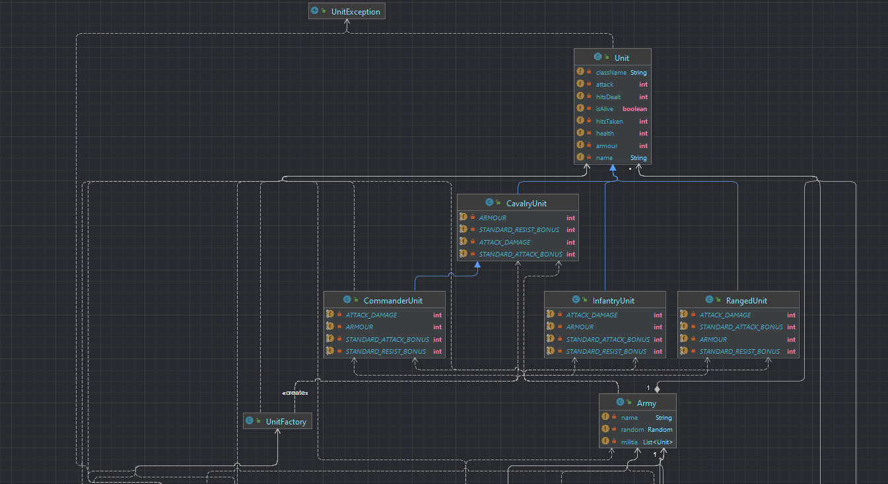
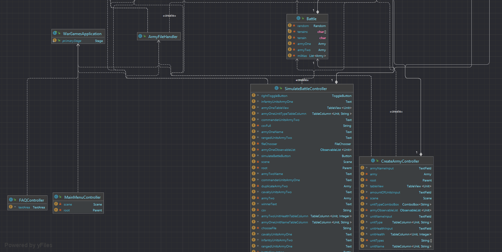
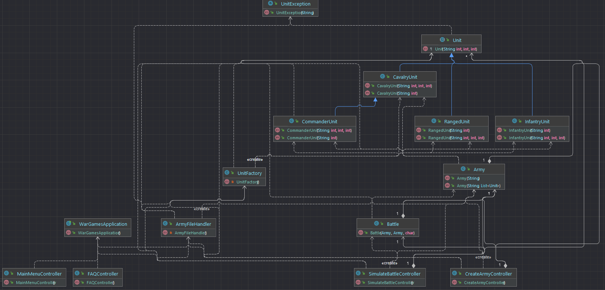
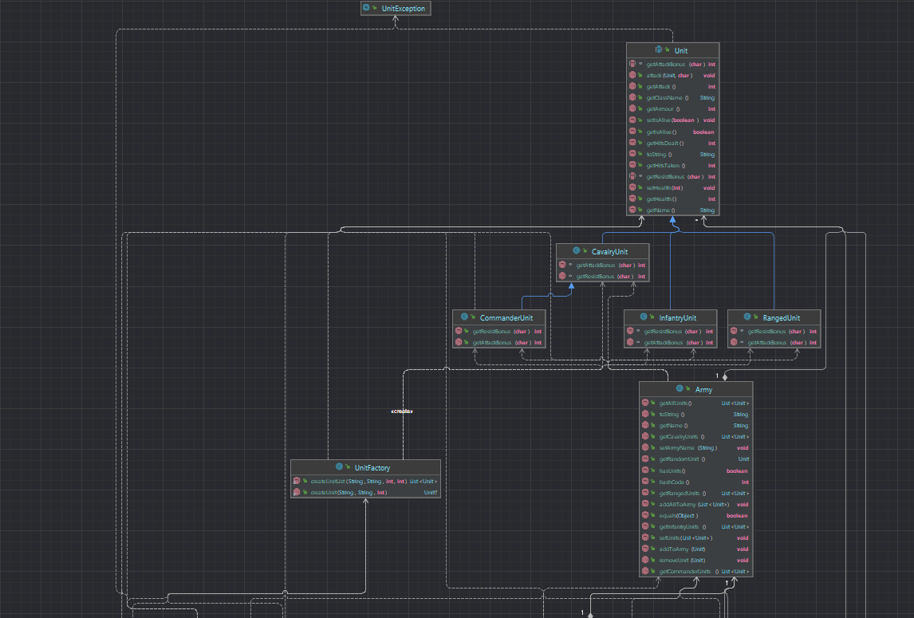
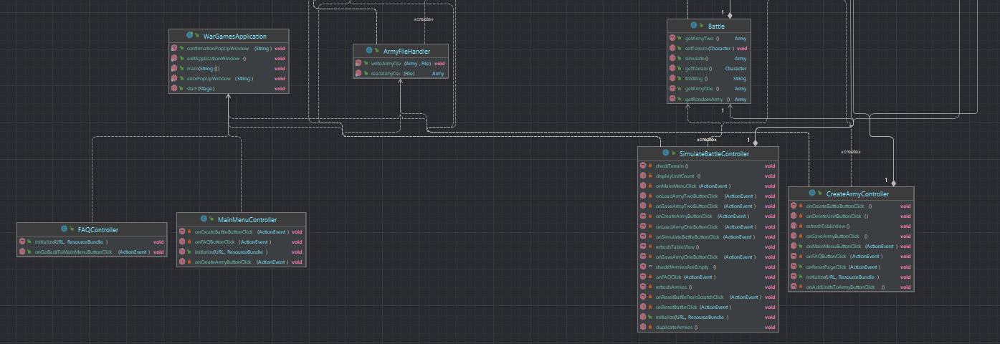
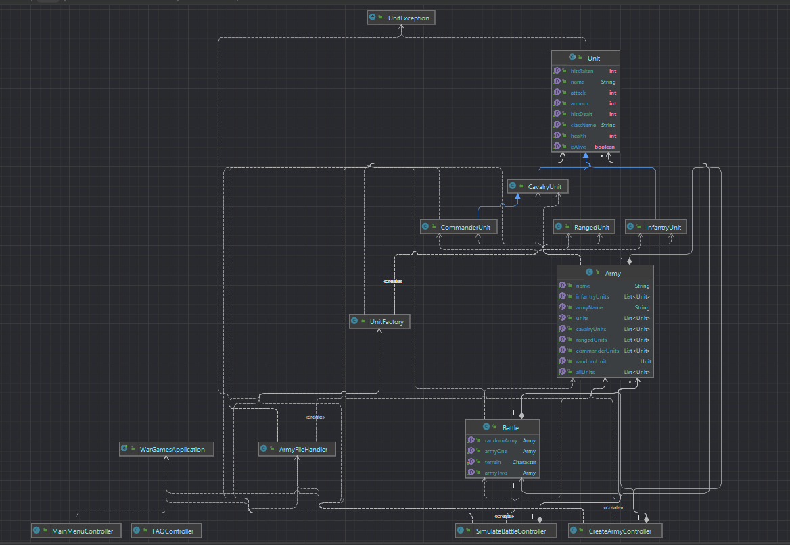

Ved å kikke på klassediagrammene kommer det fram at jeg kunne ordnet en bedre kohesjon på programmet. Jeg ville refaktorert mye av koden dersom jeg hadde hatt tid til det, og forbeholdt klassene av større grad til deres oppgave.

**UML Class Diagram without dependencies** 

**UML Class Diagram with dependencies** 

**UML Class Diagram with fields**

**UML Class Diagram with constructors** 

**UML Class Diagram with methods** 

**UML Class Diagram with properties** 
