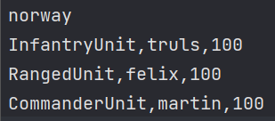

Persistense omfatter ønsket om å bevare informasjon eller gjenstander over tid. Informasjonen må være fra internminnet til permanent lagring. Objektorientert programmering, også kalt OOP, gjør dette for å bevare et objekt og dets tilstand. Du har også andre alternativer for å oppnå persistense, for eksempel ved å bruke en database, en binær fil eller en tekstfil (eksempler: .json / .xml eller / .csv). Jeg gjør dette gjennom en csv-tekstfil.

Prosessen med representasjon som en sekvens av byte med inkludert et objekts data, objektets typer data som er lagret, og informasjon om objekttypen lagres i ArmyFileHandler-klassen min. Jeg har laget en metode som tar et Army-objekt, og skriver dette til en csv-fil. Jeg har også laget en metode som leser denne filen. Når du leser filen - informasjonen, bytene og dataene brukes til å gjenskape objektet i minnet.

Jeg har brukt disse to metodene når jeg lagrer en opprettet hær (metode: createArmyCsv), og når jeg laster en hær (metode: readArmyCsv). Som nevnt før er filtypen en .csv-fil. Filen er strukturert på en bestemt måte for å kunne leses (dette er avbildet nedenfor). Når programmet trenger å lese, leser det hver fil med prøv og fang. Den prøver å lese, hvis den ikke kan - kaster den et IO-unntak.

Struktur: [armyName], [unitType, unitName, unitHealth].