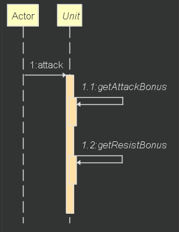
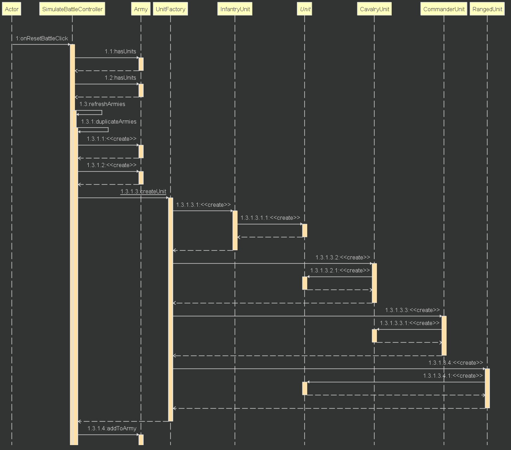
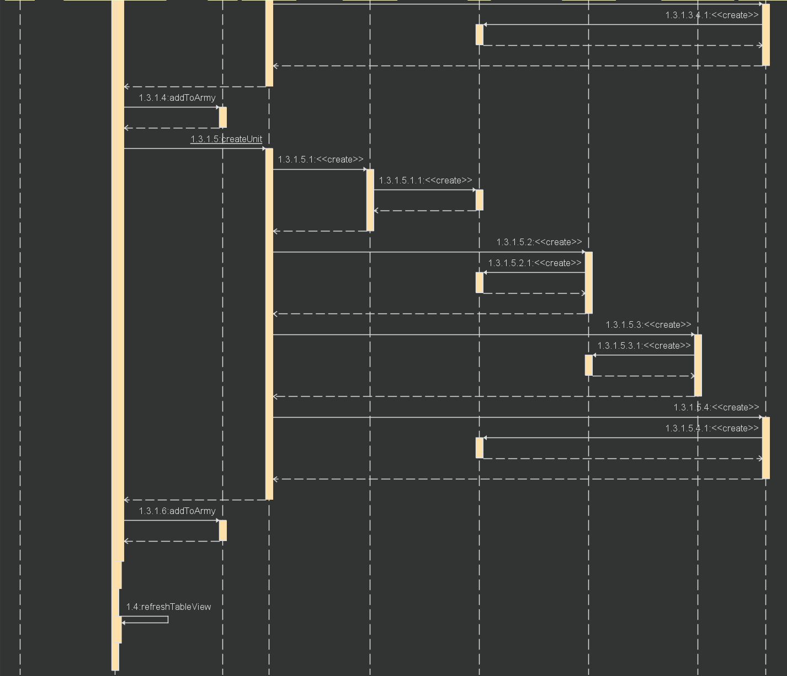
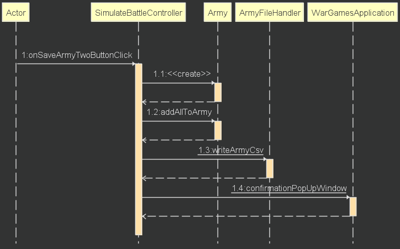
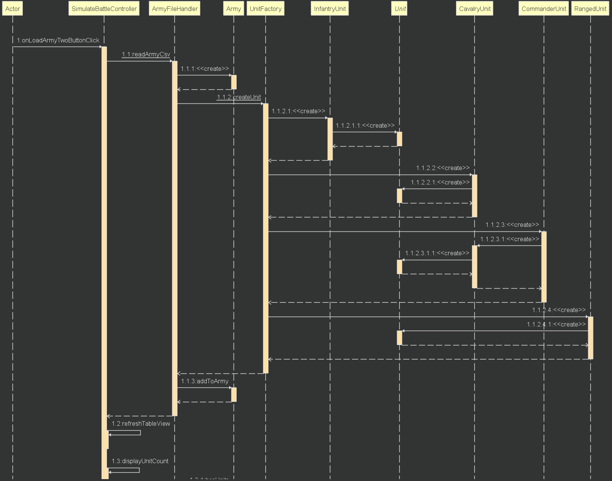
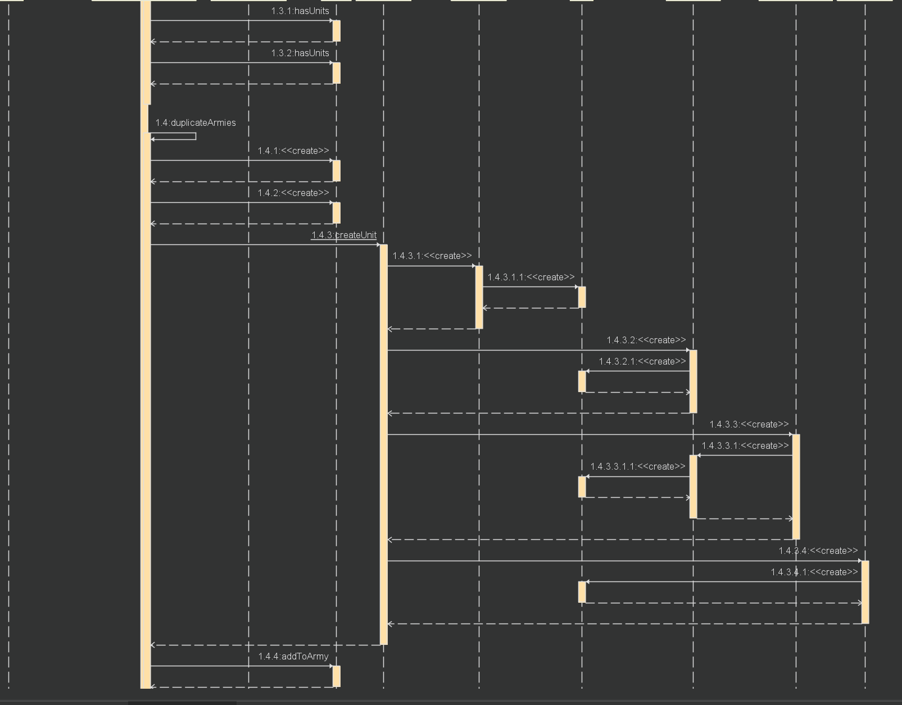
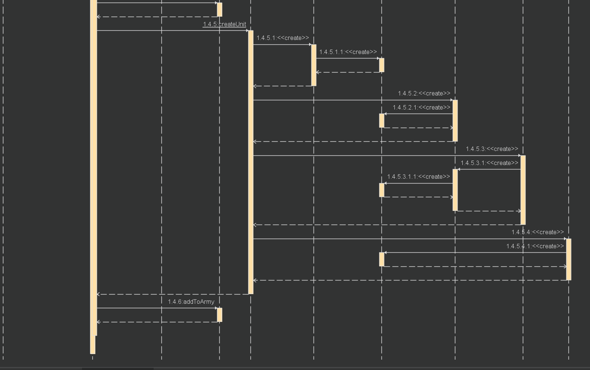

Jeg lagde bare sekvens diagram av de diagrammene jeg synes er de viktigste for programmet. 

**attack**
Jeg tar imot terrain som parameter av datatype Character i attack-metoden til Unit. Dette gjør at de abstrakte metodene til Unit også tar imot terrain som parameter. For å finne ut hvor mye health attack metoden skal fjerne sjekker den attackeren sin attack bonus og defenderen sin resist bonus (gjennom aksessorere). 

**resetBattle** 
Dette er reset metoden som tillater funksjonaliteten "å ikke måtte oppgi fillokasjon på nytt". Måten jeg løste det på var gjennom å lage to identiske hærer når jeg leser hærene. Dersom brukeren skulle ønske å resette slaget hentes de dupliserte hærene, og erstatter da de hærene som ble simulert. Etter dette blir det laget en kopi av disse igjen, slik at hvis man skulle ønske å kjøre en ny simulering følger samme prosedyre. 

**saveArmy**
Etter knappen blir trykket på lages en ny hær, og alle units i den observable listen blir lagt til i hæren. Etter dette blir en filechooser opprettet, og navnet på filen som skal lagres blir satt lik hæren sitt navn. Hæren blir så skrevet om til en fil gjennom ArmyFileHandler sin writeArmyCsv metode. Til slutt blir brukeren informert at filen er lagret gjennom en confirmationPopUp.

**loadArmy**
Først blir en filechooser opprettet, denne leser den valgte filen dersom den ikke er lik null. Den setter så hæren som allerede er implementert lik unitList-en som blir lest. Etter dette gjør den det samme med navnet på hæren. Videre, setter den verdiene i table view-en lik listen til hæren. Dette gjør også neste metode, men denne har jeg implementert grunnet den ikke alltid har klart å endre verdier. Den nestsiste metoden henter antall av hver enhetstype og totalt antall av units i hæren og viser tekst av totalene. Dersom en av hærene skulle være tomme blir den hærens verdier byttet ut med "xxx". Etter dette dupliserer jeg den nyopprettede hæren. Her bruker jeg «Creational» designmønster i form av Factory. Denne blir også kjørt før hver simulering.

