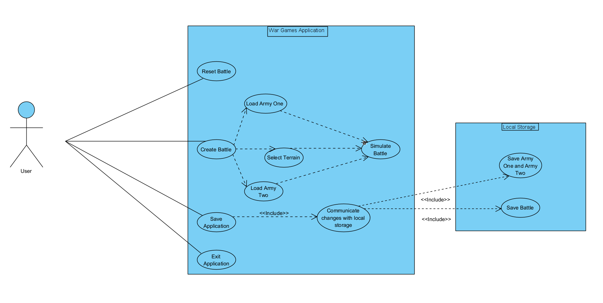
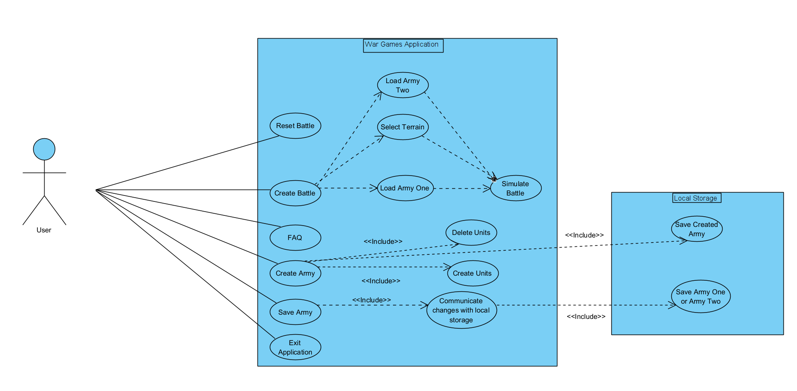

**First version of use-case diagram**

The use case diagram shows the different functionality in my war games program. The functionality are as following:

- You can load the armies from files and filepath/filename (this you have to do in order to simulate a battle)
- You can select terrain (this you have to do in order to simulate a battle)
- You can simulate a battle
- You can reset the battle
- You can exit the application
- You can save the application (in your local storage, either the battle or both the armies)

**Second version of use-case diagram (and final)**

The functionality are as following:

- You can load the armies from files and filepath/filename (this you have to do in order to simulate a battle)
- You can select terrain (this you have to do in order to simulate a battle)
- You can simulate a battle
- You can reset the battle (both by entering file locations again and without)
- You can exit the application
- You can save the application (in your local storage, by saving either army one or army two to file)

