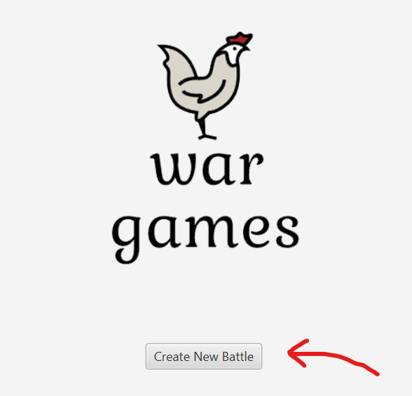
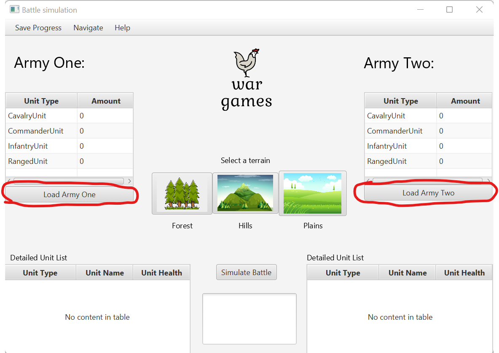
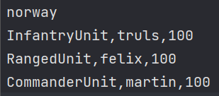
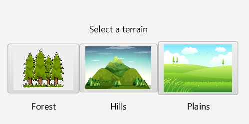
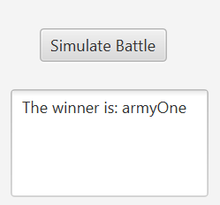
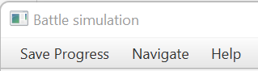
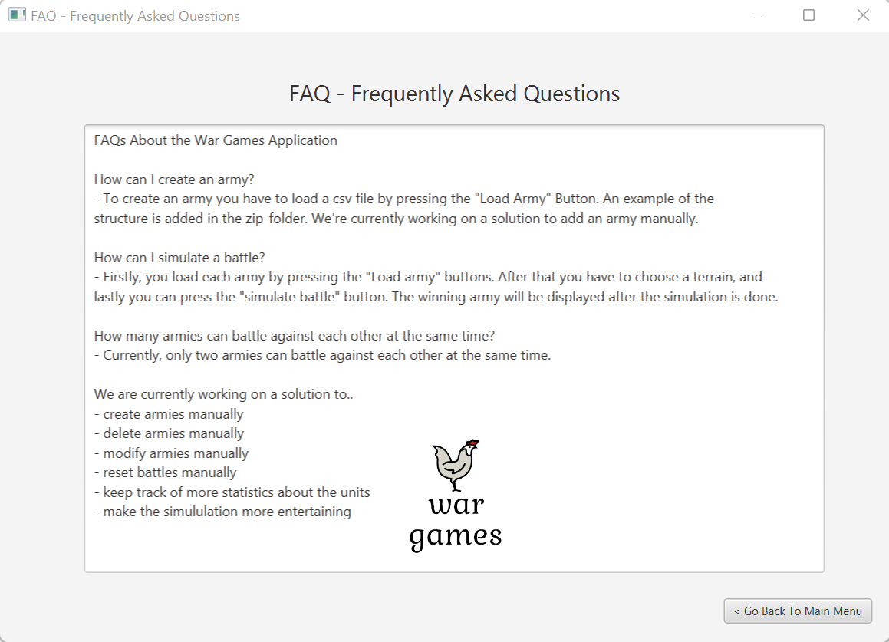

**User manual for the War Games Application - Version 1**

When opening the application, the first thing you want to do is to create a new battle. You can do that by clicking on the “Create New Battle” button. 

 
This should send you to the "Battle simulation" page. In order to simulate a battle, you will have to load both armies and select a terrain. We will start with loading each army. Press the "Load Army One" and "Load Army Two" button to select their respective armies.

The given file will have to be a csv file with this format: 
 

 
After that, click on one of the terrains in order to simulate. The selected terrain effects the different unit's attack damage bonus and recist bonus. You can read more about this in the FAQ page.

Now you will be able to simulate the battle between the two chosen armies. By pressing the "Simulate Battle" button the battle will be simulated and the winner will be displayed in the text box right below the button. 

In order to reset the battle press "Navigate" meny bar, and then "Reset Battle". You have to re-load the army files once more, and also select a terrain in order to simulate a new battle.

By pressing the "Help" meny bar and "FAQ" meny item, you will be taken to the FAQ page. Here are most of the questions about the program answered.

