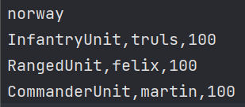

**User manual for the War Games Application - Version 2**

When opening the application, the first thing you want to do is to create an Army. You can do that by clicking on the “Create Army” button. 

 
This should send you to the "Create Army" page. In order to create an army you will have to choose 
an army name (you cannot change this after you have added units - you will have to reset the page and lose all progress). Enter values in the TextFields, the only valid input in the health and amount of units are numbers. Then press add units - you can delete units by selecting them and pressing the delete units button. When finished with creating your army press "Save File" and save the file where you would like on your local storage. The page should look something like this before you click the button.

In order to simulate a battle, you have to go to the "Simulate Battle" page. Either press directly to the page through the navigate-CreateBattle menyItem or go to main menu, and press the "create battle" button. Before you can simulate a battle, you will have to load both armies. After you have loaded each army, the page should look something like this

If the given file are not loading the file is probably of the wrong format. The file has to be a csv file (Comma Seperated File of this format: 
 

 
After that, click on one of the terrains in order to simulate. The selected terrain effects the different unit's attack damage bonus and recist bonus. You can read more about this in the FAQ page.

Now you will be able to simulate the battle between the two chosen armies. By pressing the "Simulate Battle" button the battle will be simulated and the winner will be displayed in the text box right below the button. 

In order to reset the battle press "Reset Simulation" meny bar, and then either "From scratch" or "with the same armies". If you reset the simulation from scratch you have to re-load the army files once more, and also select a terrain in order to simulate a new battle. If you reset the simulation with the same armies you do not have to do that, and can simulate right away!

By pressing the "Help" meny bar and "FAQ" meny item, you will be taken to the FAQ page. Here are most of the questions about the program answered.

