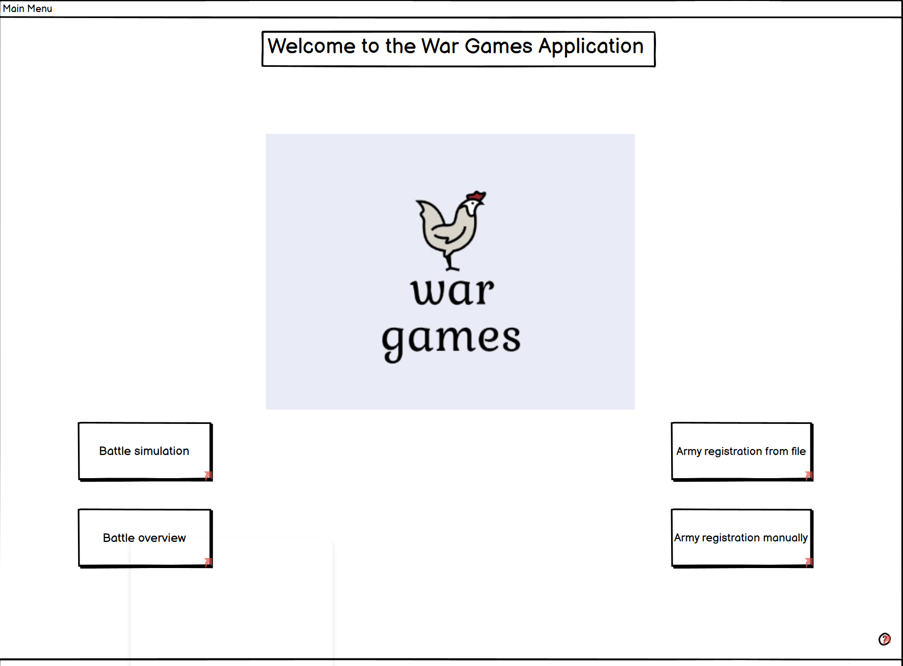
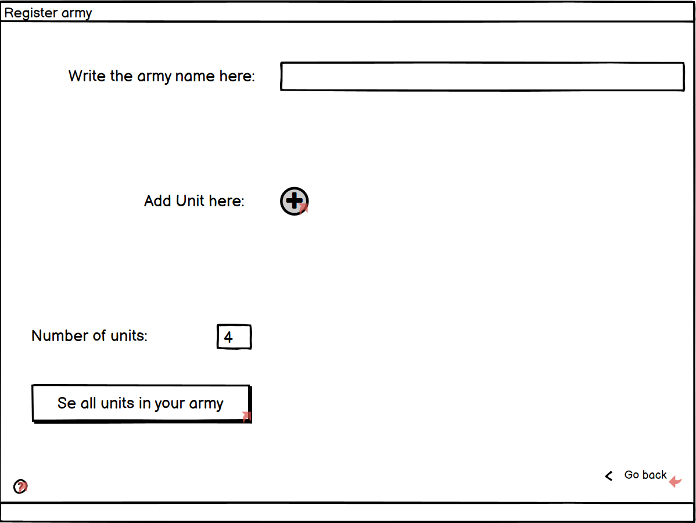
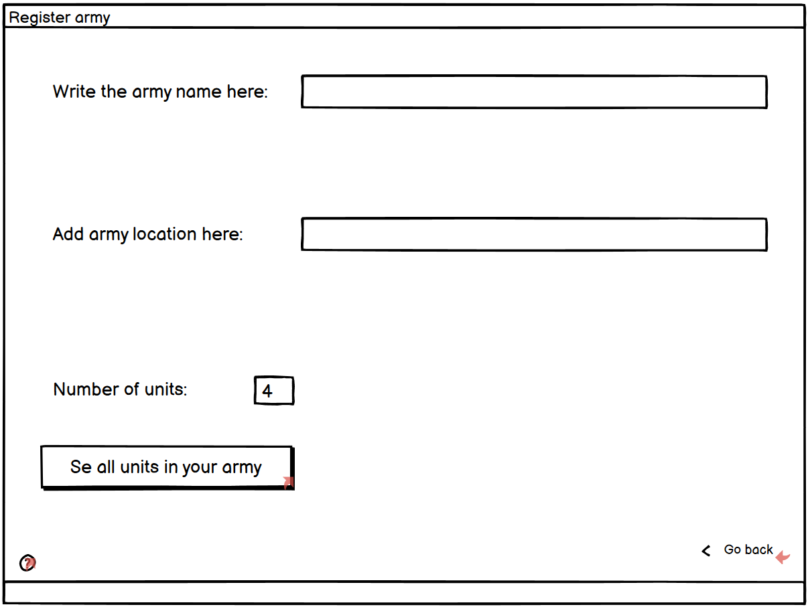
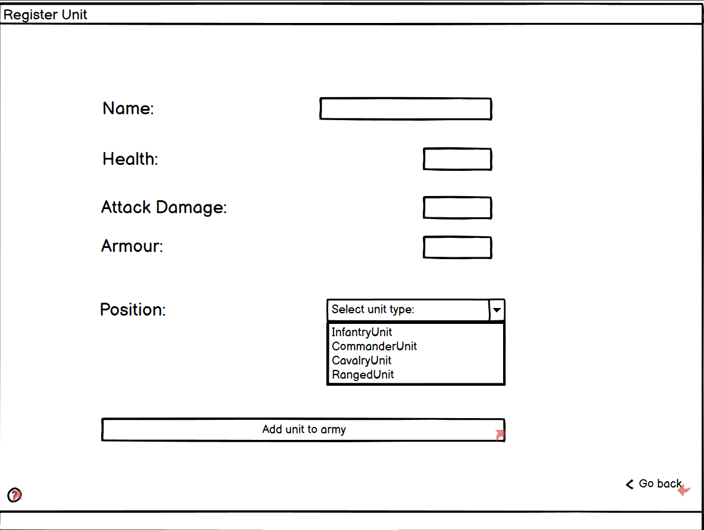
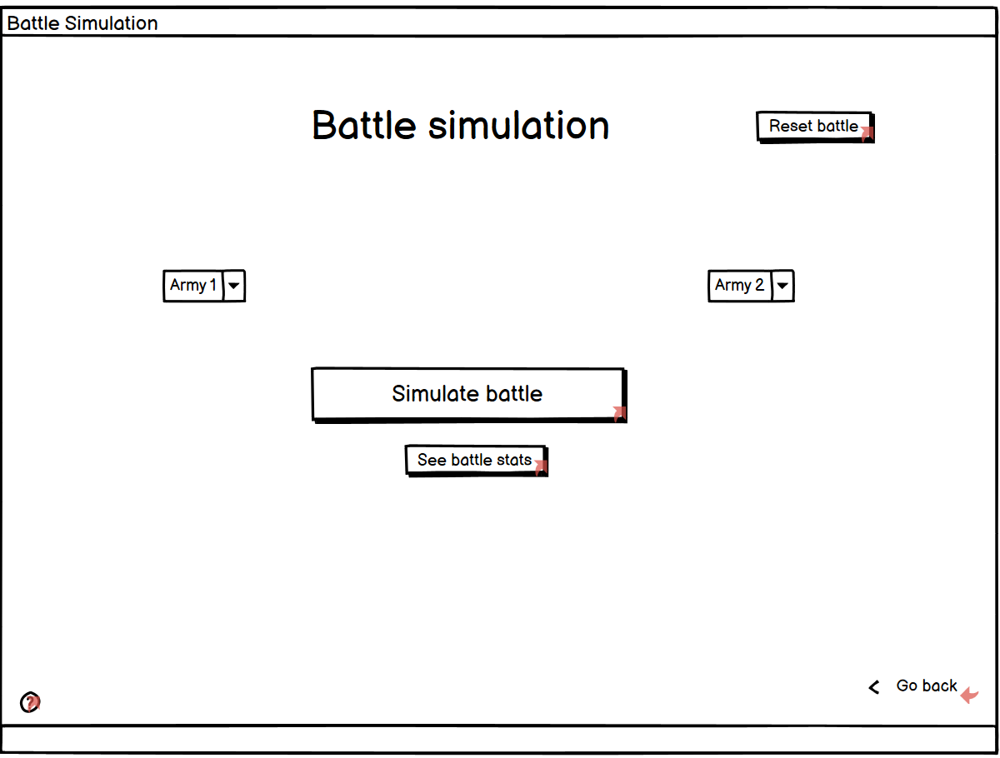
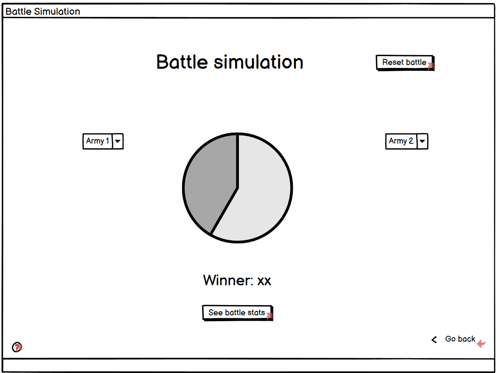
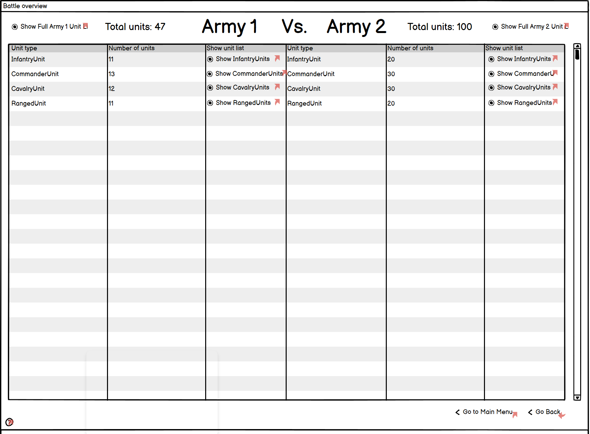
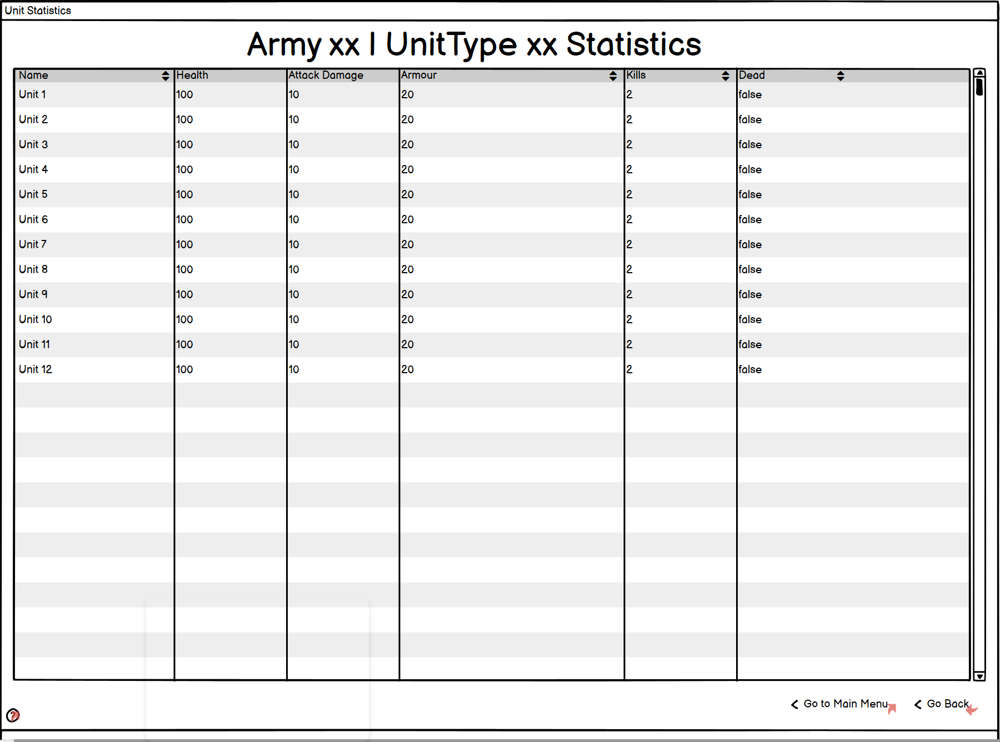
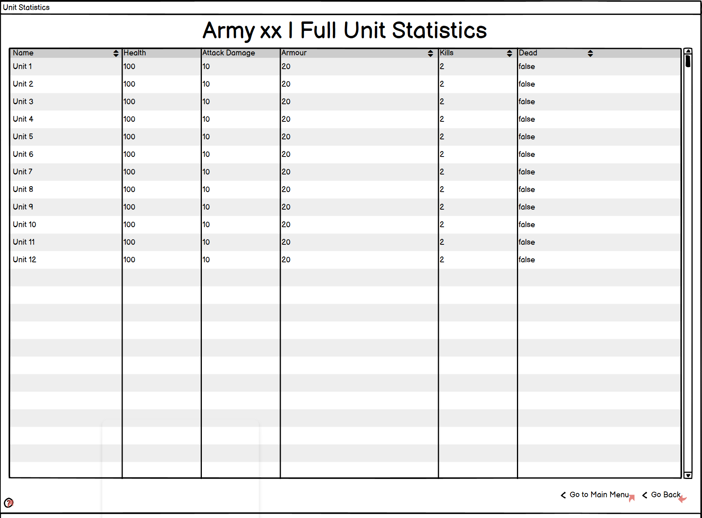
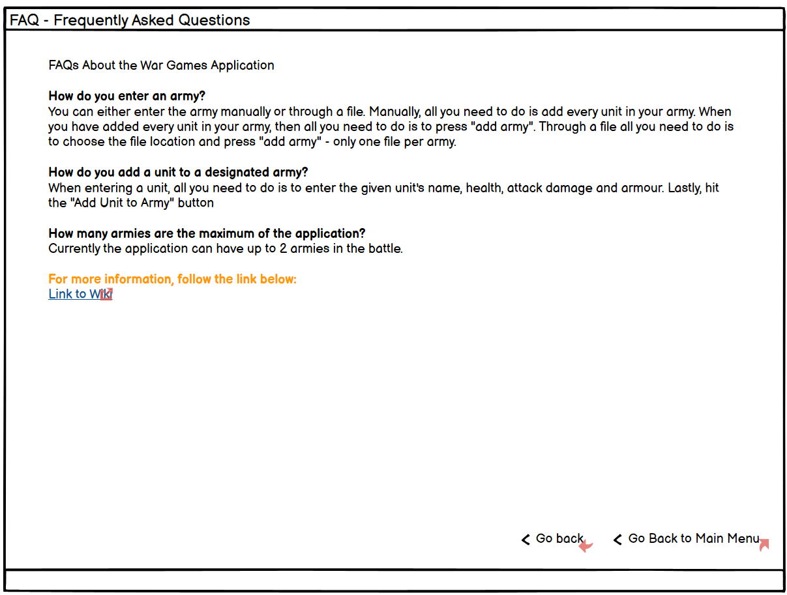

**The wireframe was a sketch for the graphical user interface of my program.** I only made one version since I found out quickly how I wanted to illustrate both look and layout. The end product and the graphical user interface differ mostly in simplicity, but also some functionality. The wireframe sketch was made with Balsamiq Wireframes.

